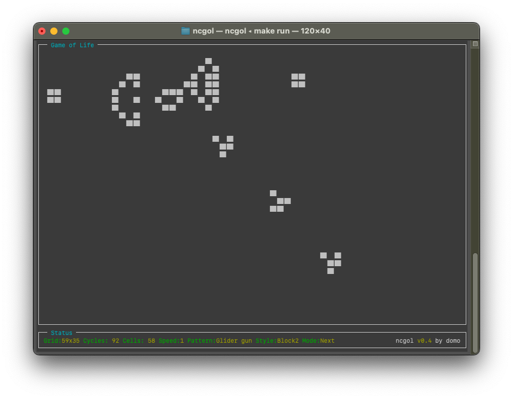
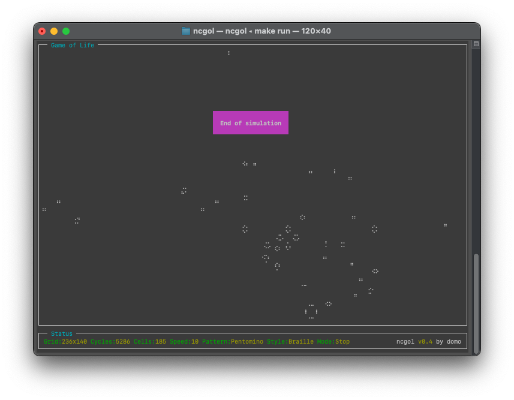

# Ncurses Game of Life

Based on Ncurses.

## Description

A basic implementation for Conway's "Game of Life" in Ncurses.

## Screenshot

## Features

- Multi-threaded calculation
- Adjustable speed
- Different start patterns
- Show count of living cells
- Show number of cycles
- Detection for end of simulation
- Dynamic adjustment to changed terminal size
- Different ui styles of living cells

## Usage

- "q" key ends the program
- "ESC" to close dialogs or timeouts
- "Up", "Down", "s" and "0" through "9" keys adjust the speed
- "Left", "Right" and "p" keys initialize the cells to a different pattern
  - Random
  - Conway (text string)
  - Still lifes
  - Oscillators
  - Spaceships
  - Glider gun (Gosper and Simkin)
  - Pentomino
  - Diehard
  - Acorn
  - Block engine 1/2
  - Double block engine
- "Space" key restarts the current pattern
- "c" key changes the character style
  - 2 terminal characters representing 1 cell (Unicode blocks / "#")
  - 1 terminal character represents 2 cells (Unicode half blocks / ASCII)
  - 1 terminal character represents 8 cells (Unicode braille dots)
- "m" key changes the mode
  - NEXT: Jump to next pattern
  - LOOP: Restart current pattern
  - STOP: Stop when pattern is finished
- "h" show help

## Roadmap

| Item                                                                | Status |
|---------------------------------------------------------------------|--------|
| Basic "Game of Life" implementation with shortcut control           | ✅     |
| Status window with values (cycles, cellcount, ...)                  | ✅     |
| Different visual modes                                              | ✅     |
| Braille visual mode with 2x4 cells per character                    | ✅     |
| End detection                                                       | ✅     |
| Different init patterns                                             | ✅     |
| Auto mode with jumping to next init pattern                         | ✅     |
| CLI parameters                                                      | ✅     |
| Optimize for speed (with multithreading)                            | ✅     |
| Manpage                                                             | ❌     |
| Prepare for distribution                                            | ❌     |
| Editor for init patterns (with import and export)                   | ❌     |
| Engine to find interesting small init patterns with long lifecycles | ❌     |

## Background

<https://en.wikipedia.org/wiki/Conway%27s_Game_of_Life>

## License

MIT License, see "License.txt".

## Author

By Martin Ochs
