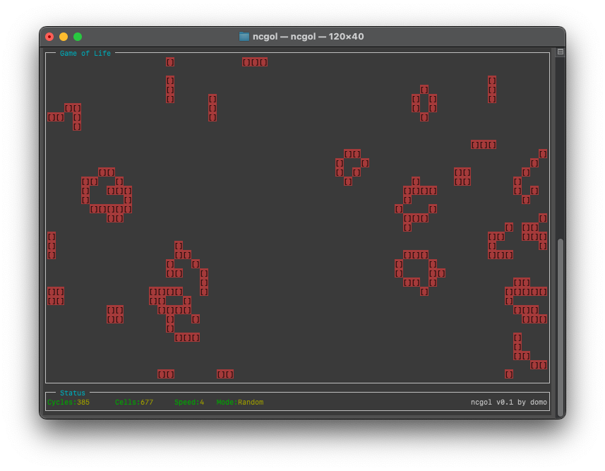

# Ncurses Game of Life

Currently in the early stages of Development.

Based on Ncurses.

Will still contain a lot of bugs!

## Description

A basic implementation for Conway's "Game of Life" in Ncurses.

## Screenshot

## Features

- (Todo) Startup screen
- (Todo) Adjustable speed (with up and down keys)
- Init with different modes (with right and left keys)
  - Random
  - (Todo) Blinker
  - (Todo) Glider
  - (Todo) Glider gun
  - (Todo) Pentomino
  - (Todo) Diehard
  - (Todo) Acorn
- Show current count of living cells
- Show current number of cycles
- (Todo) End detection with automated start of new pattern

## Usage

- The "Esc" key ends the program
- The "up" and "down" keys adjust the speed
- The "right" and "left" keys reset the cells to a random pattern

## Background

<https://en.wikipedia.org/wiki/Conway%27s_Game_of_Life>

## License

MIT License, see "License.txt".

## Author

By domo
