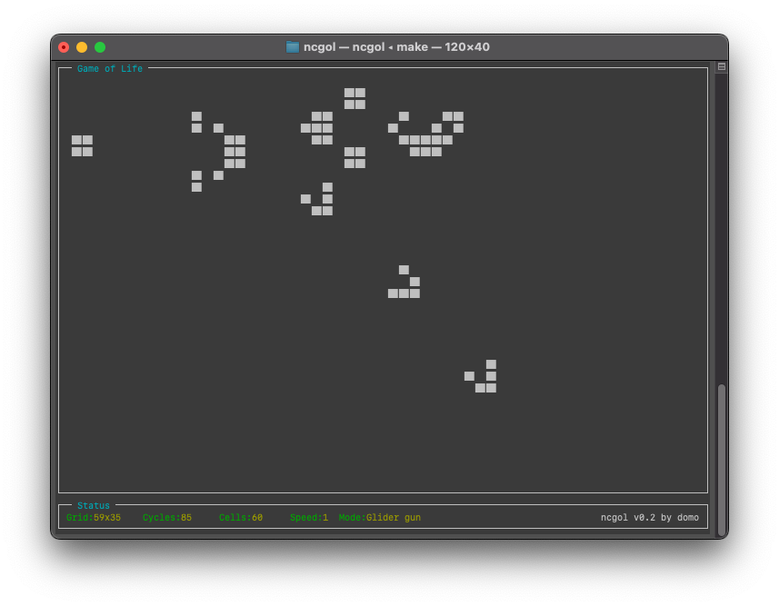
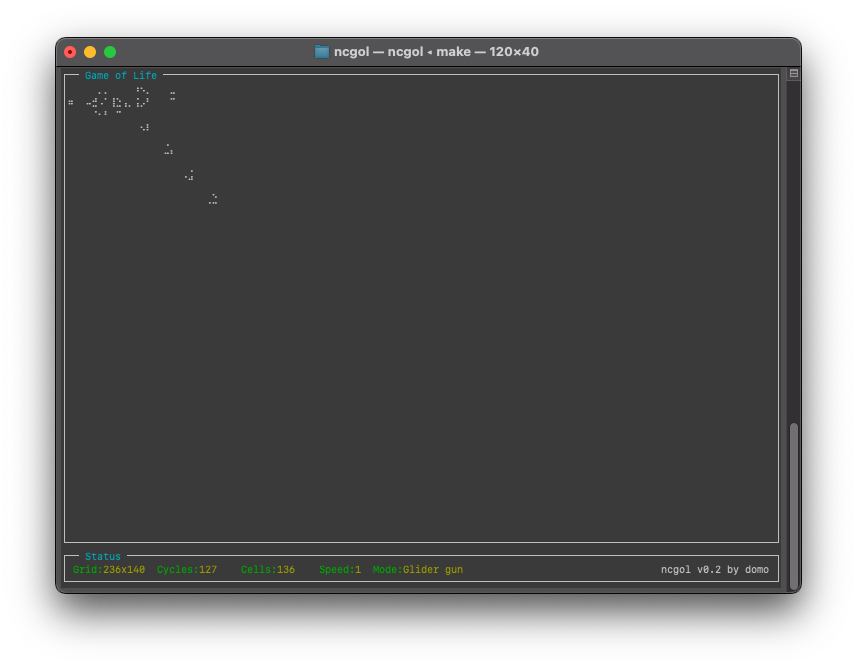

# Ncurses Game of Life

TODO: Currently in Development. Might still contain a lot of bugs!

Based on Ncurses.

## Description

A basic implementation for Conway's "Game of Life" in Ncurses.

## Screenshot

## Features

- Startup screen
- Adjustable speed (with up and down keys)
- Init with different patterns (with right and left keys)
- Show current count of living cells
- Show current number of cycles
- End detection with automated start of next pattern
- Dynamic adjustment of changing terminal size
- Different styles of cells

## Usage

- "q" key ends the program
- "Up", "Down" and "0" through "9" keys adjust the speed
- "Right" and "Left" keys initialize the cells to a different pattern
  - "r" Random
  - "b" Blinker
  - "g" Glider
  - "l" Glider gun
  - "p" Pentomino
  - "d" Diehard
  - "a" Acorn
- "Space" key restarts the current pattern
- "s" key changes the style
  - 2 chars representing 1 cell (Unicode blocks / "#")
  - 1 char represents 2 cells (Unicode braille dots / Unicode half blocks / ASCII)
  - 1 char represents 8 cells (Unicode braille dots)
- "m" key changes the mode
  - NEXT: Jump to next pattern
  - LOOP: Restart current pattern
  - STOP: Stop when pattern is finished

## Background

<https://en.wikipedia.org/wiki/Conway%27s_Game_of_Life>

## License

MIT License, see "License.txt".

## Author

By domo
